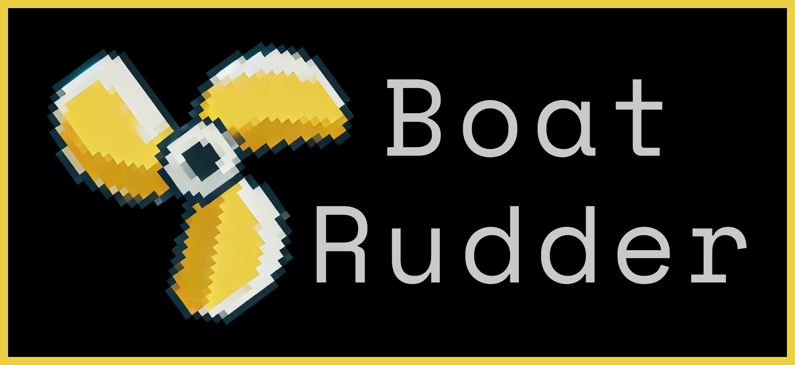

# Boat Rudder CMS

Boat Rudder is a modular Content Management System (CMS) written in C, designed to support a wide range of browsers with backwards compatibility through epochs. The CMS organizes its components efficiently to deliver dynamic content such as blogs and home pages with customizable themes and language support.

## Features

- **Backward Compatibility:**
  - **Epoch 1 (Early):** Basic HTML templates for older browsers (e.g., Netscape Navigator 3.0, Internet Explorer 4.0).
  - **Epoch 2 (Middle):** CSS1/CSS2 templates for mid-era browsers (e.g., Internet Explorer 6.0, Firefox 1.0).
  - **Epoch 3 (Modern):** HTML5 and CSS3 templates for modern browsers (e.g., Google Chrome 90+, Microsoft Edge, Mozilla Firefox 90+).
- **Dynamic Content Management:** Blog and homepage content generated dynamically from APIs and databases.
- **Theming:** Supports both dark and light themes.
- **Language Support:** Multilingual capabilities (English and Spanish).
- **Google Sheets Integration:** Fetches content directly from Google Sheets API.

## Architecture Overview

The project is organized into modular components, each handling a specific functionality. Below is the directory structure:


```
boat-rudder/
├── configs/
├── src/
│   ├── api/
│   ├── html/
│   │   ├── assets/
│   │   ├── images/
│   │   ├── themes/
│   │   │   ├── dark/
│   │   │   └── light/
│   ├── include/
│   ├── lib/
│   ├── modules/
│   │   ├── blog/
│   │   ├── container/
│   │   ├── forms/
│   │   ├── home_blog/
│   │   ├── menu/
│   │   └── slider/
│   ├── utils/
│   └── web-server/
└── ssl/
```

## Key Components

### `main.c`
The entry point of the CMS:
- Loads configurations from `configs/config.txt`.
- Initializes the HTTP server (`request_handler.c`).
- Hands over control to the orchestrator module (`orchestrator.c`).

### Themes
Themes are located in `html/themes/` and include:
- **Dark Theme:** `html/themes/dark/`
- **Light Theme:** `html/themes/light/`

## Setup Instructions

### Prerequisites
- GCC or any C compiler.
- Basic understanding of C programming.
- Access to Google Sheets API (API key required).
- **Build Tools:** CMake is required for managing the build process.

### System-specific Dependencies

#### Linux (Arch/Manjaro)
```bash
sudo pacman -Syu cmake gcc
```

#### Linux (Ubuntu/Debian-based)
```bash
sudo apt update && sudo apt install -y cmake gcc build-essential
```

#### Linux (Red Hat/CentOS/Fedora)
```bash
sudo dnf install cmake gcc make
```

#### macOS
1. Install Homebrew (if not already installed):
   ```bash
   /bin/bash -c "$(curl -fsSL https://raw.githubusercontent.com/Homebrew/install/HEAD/install.sh)"
   ```
2. Install dependencies:
   ```bash
   brew install cmake gcc
   ```

#### Windows
1. Install [CMake](https://cmake.org/download/) and add it to your PATH.
2. Install [MinGW](https://sourceforge.net/projects/mingw/) or another GCC-compatible compiler.

### Installation
1. Clone the repository:
   ```bash
   git clone https://github.com/pablotoledom/boat-rudder.git
   ```
2. Navigate to the project directory:
   ```bash
   cd boat-rudder
   ```
3. Generate build files with CMake:
   ```bash
   cmake -S . -B build
   ```
4. Compile the project:
   ```bash
   cmake --build build
   ```

### Running the CMS
1. Update the configuration file located at `configs/config.txt`.
2. Start the application:
   ```bash
   ./bin/boat-rudder
   ```

## Future Enhancements
- Extend compatibility to additional languages.
- Introduce more themes.
- Add support for other data sources.

## Contributing
Contributions are welcome! Please fork the repository, make your changes, and submit a pull request.

## License
This project is licensed under the MIT License. See the `LICENSE` file for details.